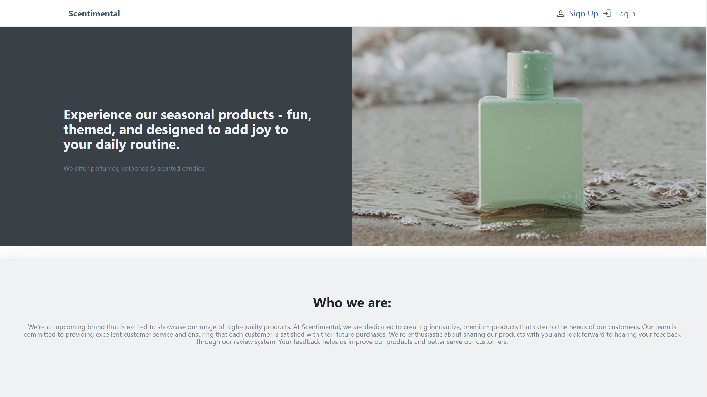
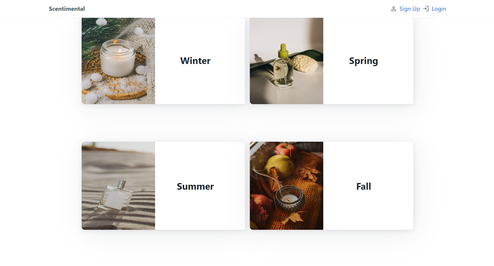
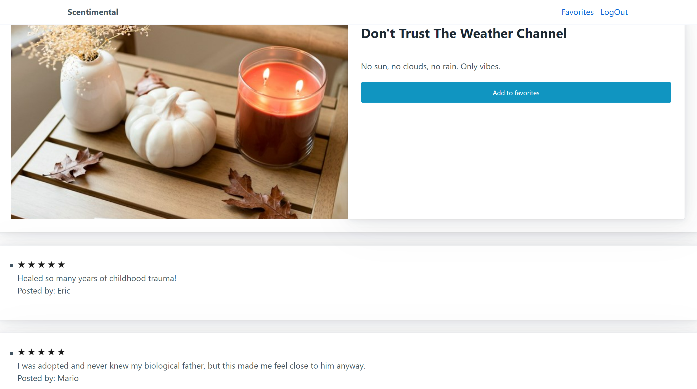
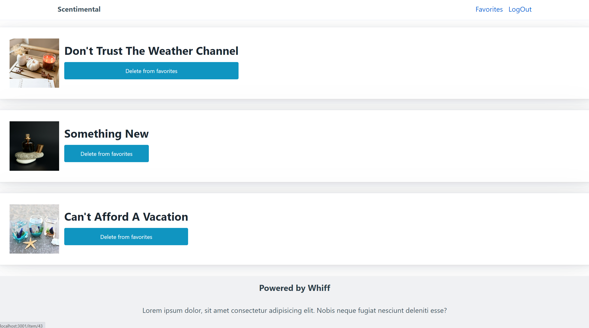

# Scent-imental
This is a full-stack e-commerce website.

## Website Link
[Click Here!](https://frozen-brushlands-88801.herokuapp.com/)

## Description
Scent-imental is an ecommerce website for a business that will be opening soon. The website is available to showcase the products that the business will provide. Scent-imental has multiple fuctionalities. The user can sign up with their email, login to their own account and log out when finished. Then the user may scroll through the website to view products and give the business owners an idea as to what products they may or may not like by using the review and favorite functionalities, both of which can only be done when logged in. Users can also view the reviews of other users to each of the products when logged in.

## Table of Contents
- [Screenshots](#screenshots)
- [Installation](#installation)
- [Usage](#usage)
- [License](#license)
- [How to Contribute](#how-to-contribute)
- [Tests](#tests)

## Screenshots

## Installation
N/A

## Usage
This project is used to demonstrate our utilization of front-end and back-end technologies to create a full-stack website. 

## License
[!License: MIT](https://choosealicense.com/licenses/mit/)

## How to Contribute
N/A

## Tests
N/A
